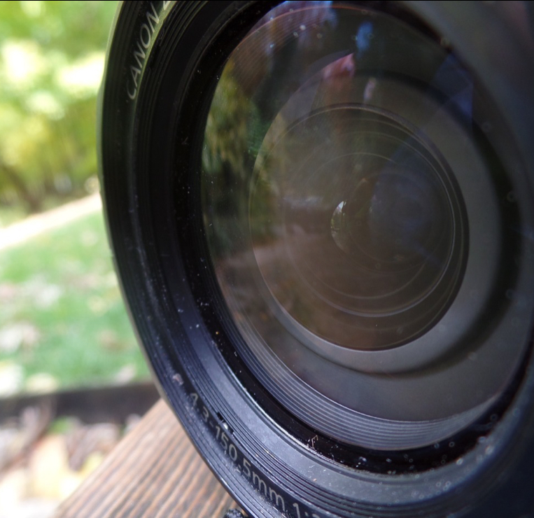
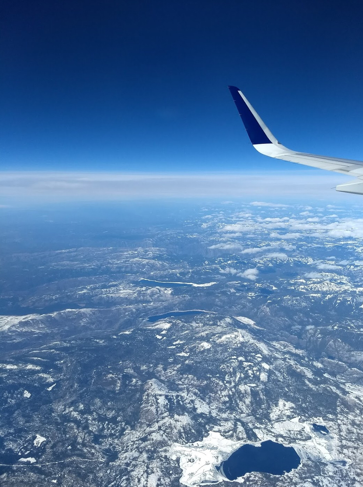

 

 <a href="https://owensphotography.tumblr.com/">Photos</a>: A page where I post all of my photos I took!
 
 <a href="https://owenm06.github.io/Coding06.github.io/">Coding</a>: My coding experience!
<h1> Welcome To My Website! </h1>
<h2> A BIT ABOUT ME </h2>
  
 My name is Owen. My interests include rocketry, space, science, and art. I have an interest in space because I feel that it is awesome that humans are exploring the most inhospitable, dangerous, yet beautiful places. I also take an interest in photography, although I am still learning! I enjoy science because it makes the world we live in so much easier to navigate, work in, and live in. I love to travel and explore. In addition to this, I enjoy camping and nature. 
I also take an interest in aircraft (mainly planes) 

 
 I am an amature photographer. I go outside whenever I can and shoot photos. I mainly take pictures of nature, although I also take city photography occasionally.   

<h6> <a href="https://github.com/Owenm06/OwenM06.github.io/blob/master/README.md">Copyright, Readme</a> ©Owen Murtha, 2018, All Rights Reserved. </h6>
